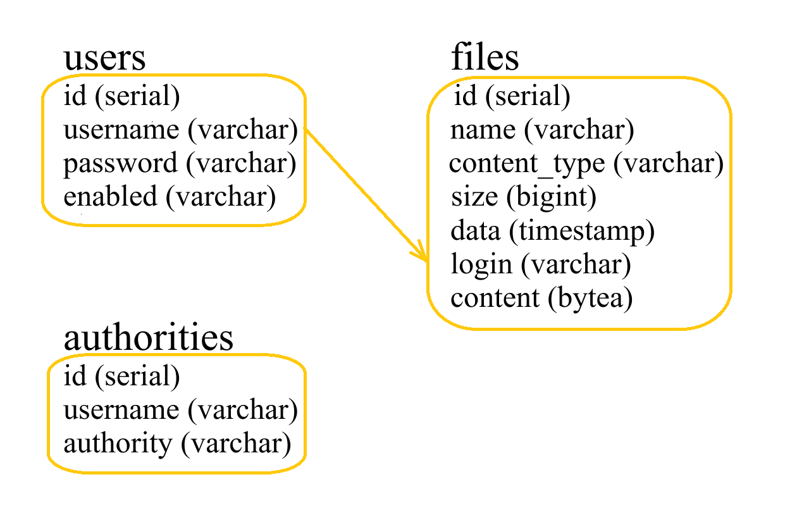

# Дипломная работа «Облачное хранилище»

### Описание проекта
Задача — разработать REST-сервис. Сервис должен предоставить REST-интерфейс для загрузки файлов и вывода списка уже загруженных файлов пользователя.

Все запросы к сервису должны быть авторизованы. Заранее подготовленное веб-приложение (FRONT) должно подключаться к разработанному сервису без доработок, а также использовать функционал FRONT для авторизации, загрузки и вывода списка файлов пользователя.

### Требования к реализации
Приложение разработано с использованием Spring Boot.
Использован сборщик пакетов gradle/maven.
Для запуска используется docker, docker-compose.
Код размещён на Github.
Код покрыт unit-тестами с использованием mockito.
Добавлены интеграционные тесты с использованием testcontainers.

### База данных
В проекте используется СУБД Postgresql

Схема базы данных:
